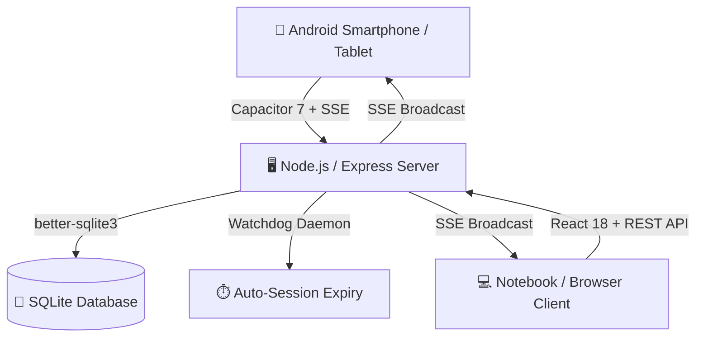

# 🎮 KidsScreenTime — Familien-Medienzeit Cockpit & Timer

[](https://opensource.org/licenses/MIT)
[](https://nodejs.org/)
[](https://reactjs.org/)
[](https://capacitorjs.com/)
[](https://www.sqlite.org/)

**KidsScreenTime** ist eine moderne, intuitive und kindgerechte Web- & Android-Applikation zur transparenten Organisation von Bildschirm- und Spielzeiten in der Familie.

---

## ✨ Highlights & Features

### 👦 1. Kindgerechtes Dashboard (Kinder-Cockpit)
* **Animierter Circular Timer**: Live-Countdown mit dynamischem Farbring (Grün ➔ Gelb ➔ Rot) für verbleibende Spielzeit.
* **Guthaben-Sparschwein 🐷**:
  * 📅 **Wochenguthaben**: Automatische wöchentliche Zuteilung des Basis-Budgets.
  * 🎁 **Bonus-Guthaben**: Belohnungsminuten (z. B. für Hilfe im Haushalt oder Hausaufgaben).
  * 🐷 **Gesamtkonto**: Übersichtliche Zusammenfassung.
* **Geräte-Auswahl**: Direkter Start von Spielzeit auf PC, Konsole, Tablet oder Smartphone.
* **Wochenübersicht (KW-Navigation)**: Transparente Darstellung der genutzten Zeiten pro Wochentag.
* **Mobile First & Responsive**: Perfekt optimiert für jedes Smartphone (ab 360px Breite) bis hin zu Laptops & Tablets.

### 🛡️ 2. Eltern-Kontrollzentrum (PIN-geschützt)
* **Sicherer PIN-Zugang**: Schutz vor unbefugtem Zugriff durch PIN (Standard: `1307`).
* **📡 Live-Monitor aller Kinder**: Echtzeit-Überblick aller aktiven Sitzungen inkl. Pause-, Stopp- und Bonus-Sofortfunktionen.
* **Tages- & Wochenkorrektur**: Nachträgliche minutengenaue Korrektur einzelner Tage und Geräte.
* **Bonusguthaben-Verwaltung**: Manuelles Hinzufügen oder Abziehen von Belohnungszeit mit Begründungsnotiz.
* **Stammdaten & Gerätesperren**:
  * Kinder anlegen, bearbeiten und Budgets konfigurieren.
  * Spielgeräte fest zuweisen oder bei Bedarf sofort sperren (🔒).
  * Anzeige-Smartphones zentral bestimmten Kinder-Cockpits zuordnen.

### 📱 3. Standby- & Lockscreen-Alarm (Echtzeit-Synchronisation)
* **Native Android Background-Integration**: Läuft zuverlässig auch wenn der Bildschirm gesperrt ist oder das Notebook den Timer steuert.
* **Server-Sent Events (SSE)**: Echtzeit-Signalisierung über HTTP-Events.
* **AlarmManager mit `setAlarmClock()`**: Weckt das Smartphone sekundengenau aus dem Deep Sleep (Doze Mode).
* **Audio-Alarm, Vibration & Sprachausgabe**: Kindgerechte Sprachansage (*„Achtung! Die Spielzeit von ... ist abgelaufen!“*).

### 📜 4. Revisionssicheres Audit- & Telemetrie-Protokoll
* Lückenlose Aufzeichnung aller Transaktionen, Pausen, Stopps und manueller Anpassungen.
* Live-Telemetrie-Protokoll für Smartphone-Events und Hintergrunddienste.

---

## 🏗️ Architektur & Tech-Stack



* **Frontend**: React 18, Vite, modernes Vanilla CSS mit Design-Tokens & Glassmorphism.
* **Backend**: Node.js, Express, `better-sqlite3`, Server-Sent Events (SSE).
* **Mobile Hybrid**: Capacitor 7, Android Native Foreground Service (`BackgroundSyncService.java`).
* **Datenbank**: SQLite (`screentime.db`) mit automatischer Migration und Integritätsprüfung.

---

## 📁 Projektstruktur

```text
ScreenTimeOrga/
├── android/                   # Native Android-Projekt (Capacitor)
│   └── app/src/main/java/.../ # BackgroundSyncService.java (SSE & Standby Alarm)
├── client/                    # React Frontend (Vite)
│   ├── src/
│   │   ├── components/        # ChildDashboard, ParentControlCenter, CircularTimer
│   │   ├── utils/             # audioManager.js (HTML5 Audio, TTS, Vibration)
│   │   └── index.css          # Responsives Designsystem & Mobile Styles
├── server/                    # Node.js Express Backend
│   ├── routes/                # api.js (REST API & SSE /events)
│   ├── db.js                  # SQLite Initialisierung & Schemas
│   ├── events.js              # SSE Client-Hub & Broadcast-Manager
│   └── watchdog.js            # Hintergrund-Überwachung abgelaufener Sessions
├── doc/                       # Ausführliche Architektur- & Rollback-Dokumentation
│   └── BACKGROUND_SYNC_SERVICE.md
├── build-apk.sh               # 1-Klick Build-Skript für Web & Android APK
└── package.json               # Abhängigkeiten und Skripte
```

---

## 🚀 Installation & Start

### Voraussetzungen
* **Node.js** (Version 18 oder neuer)
* **NPM** (Version 9 oder neuer)
* *(Optional für APK-Build)*: **Android SDK & Java JDK 17**

### 1. Repository klonen & Abhängigkeiten installieren
```bash
git clone https://github.com/djbj1/KidsScreenTime.git
cd KidsScreenTime

# Root & Server Dependencies
npm install

# Frontend Dependencies
cd client && npm install && cd ..
```

### 2. Server starten
```bash
# Startet den Express Backend Server auf Port 3000
npm start
```
Die Anwendung ist nun erreichbar unter: `http://<DEINE-IP-ADRESSE>:3000`

### 3. Frontend im Entwicklungsmodus starten
```bash
cd client
npm run dev
```

---

## 📲 Android App (.APK) bauen

Ein automatisiertes Skript führt den Frontend-Build, Capacitor-Sync und den Gradle-Build durch:

```bash
chmod +x build-apk.sh
./build-apk.sh
```

Nach erfolgreichem Build liegt die APK bereit unter:
* Im Dateisystem: `android/app/build/outputs/apk/debug/app-debug.apk`
* Als Download im Server-Webbereich: `http://<DEINE-IP-ADRESSE>:3000/screentime.apk`

---

## 🔒 Eltern-PIN

* Der Standard-PIN für den Elternbereich lautet: **`1307`**
* Im Elternbereich können jederzeit Zeiten korrigiert, Boni verteilt und Kinder/Geräte verwaltet werden.

---

## 📄 Lizenz

Dieses Projekt ist unter der [MIT-Lizenz](LICENSE) lizenziert.
